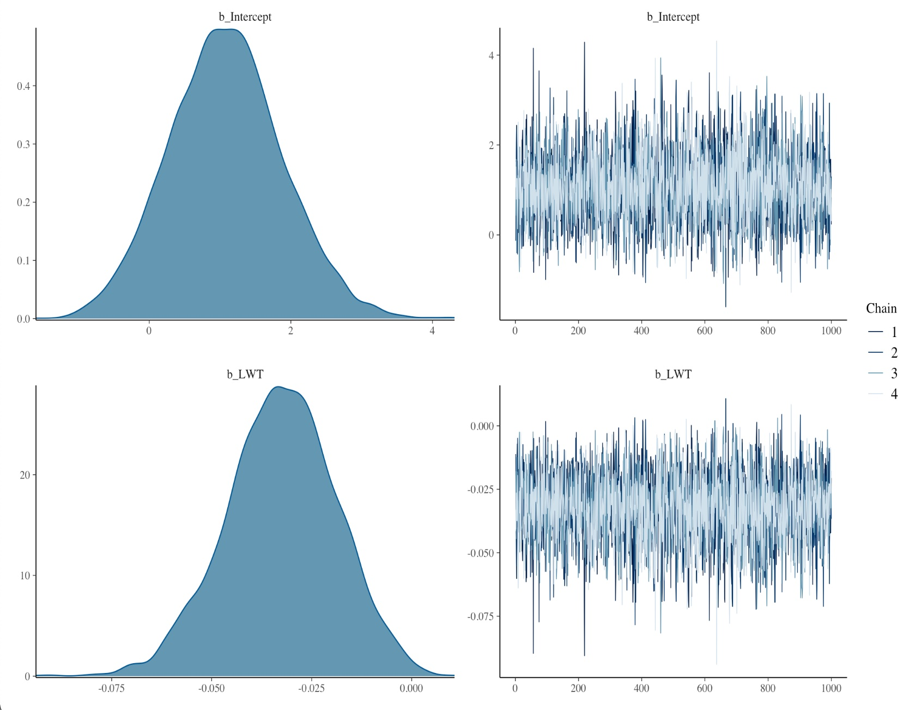

```{r, echo=FALSE}
knitr::opts_chunk$set(eval = FALSE)
```


# Exercise 1 - Get Started

**a.** Open RStudio, and then open a new project by clicking File --> New Project. Give the project a name and save it somewhere.

**b.** [Download the dataset from this link](https://github.com/osorensen/BayesCourseEPINOR2021/blob/main/data/bwt.rds), and put it in the project directory you just created.

**c.** Open a new R script. Load the brms package with the following line, and pressing Ctrl+Enter, or the "Run" icon at the top left corner. You might also save the R script.

```{r}
library(brms)
```

Whenever working with R, it is also useful to load [the tidyverse](https://tidyverse.org/). If you don't have it, start with `install.packages("tidyverse")`. If you want to get good at handling data with R, [check out this free e-book](https://r4ds.had.co.nz/).

```{r}
library(tidyverse)
```


**d.** Load the dataset. As long as the R Project you created in step 1 is open, and you but the data in the project directory, this should be all you need.

```{r}
dat <- readRDS("bwt.rds")
```

**e.** Fit the same model as we did in the lecture, by running this code.

```{r}
mod <- brm(Low ~ LWT, data = dat, family = bernoulli(),
           prior = c(set_prior(prior = "normal(0, 0.4)", 
                               class = "b", coef = "LWT")))
```

**f.** Verify that everything works by creating a plot like this:

```{r, echo=FALSE}
plot(mod)
```



# Exercise 2 - Add Smoking Status

We now want to add smoking status to our model for low birthweight. We have already spent some time determining our prior for the effect of the mother's weight, but now we want to do the same for the effect of smoking.

## Specify Prior Distribution

Smoking is a dichotomous variable, coded as TRUE/FALSE in the dataset. Hence, in a multiple logistic regression model of the following form

$$P(\text{Low}) = \text{logit}\left(\beta_{0} + \beta_{LWT} \text{LWT} + \beta_{Smoker} \text{Smoker}\right),$$

the regression coefficient $\beta_{Smoker}$ represents the log odds ratio for smoking status on low birthweight, controling for the effect of mother's weight. That is,

$$\text{OR}(\text{Smoker}) = e^{\beta_{Smoker}}.$$
We will use a normal distribution to encode our prior knowledge about the effect of smoking, but it is up to you to decide about the mean and the standard deviation.

**a.** Copy this script into your own project, run it line-by-line, and make sure you understand what it does.

```{r}
prior_mean <- 0
prior_sd <- 2
probs <- c(.025, .5, .975)

prior_quantiles_beta <- qnorm(probs, mean = prior_mean,
                              sd = prior_sd)

prior_limits_odds_ratio <- exp(prior_quantiles_beta)
```

In particular, look at the output you get when typing `prior_limits_odds_ratio` in the R console. How is it related to [this quote](https://doi.org/10.1093/ije/dyi312)?

> ... my 95% prior limits are a pair of numbers $RR_{lower}$ and $RR_{upper}$ such that I would give $95 : 5 =  19:1$ odds that the true risk ratio is between these numbers, i.e. $P(RR_{lower} \leq RR \leq RR_{upper}) = 0.95$ if I disregarded the analysis data.

Try different values for `prior_mean` and `prior_sd`, and arrive upon a prior distribution which you feel appropriately reflects your prior knowledge about the subject.


## Compute the Model Estimates

**b.** Using your prior from the last step, fit a multiple logistic regression model for low birthweight, containing both the mother's weight at the end of the last menstrual cycle and her smoking status.

The following script should get you started, but unless you agree completely with my prior, you should probably edit the last part. The syntax `"normal(0, 2)"` specifies the mean (0 in this case) and the standard deviation (2 in this case).

```{r}
mod <- brm(
  Low ~ LWT + Smoker, data = dat, 
  family = bernoulli(),
  prior = c(
    set_prior(prior = "normal(0, 0.4)", class = "b", 
              coef = "LWT"),
    set_prior(prior = "normal(0, 2)", class = "b", 
              coef = "SmokerTRUE")
  ))
```

## Check that Computations Worked Correctly

Having fitted the model, we need to confirm that computations worked satisfactorily. You probably got a hint in the long output from the last code chunk, but you can get more visual information from the `plot` function for `brms` models.


**c.** Run `prior_summary(mod)` and see if your prior distribution has been correctly encoded.

**d.** Run `plot(mod)` and take a look at what comes out. Are you able to make a plot which does not contain the intercept? 

Hint: type `help("plot.brmsfit")` in the R console and take a look at the `variable` argument.

**e.** Look at the summary, `summary(mod)`. What is the effective sample size, and what does this mean?

**f.** Check out ShinyStan, which gives you all the information you need via a graphical interface. If you don't have ShinyStan, start with `install.packages("shinystan")`.

```{r}
library(shinystan)
launch_shinystan(mod)
```


## Posterior predictive checks

**g.** Type `help("pp_check")` in the R console and take a look at the examples which that you find at the bottom. Try to run some of them, and interpret the plots that come out. Are there some options which don't make sense for a logistic regression model, but that would make sense, say, for a linear regression model?

**h.** The plots shown in [the lectures](part-iii-brms-and-stan.html) were for a model that did not include smoking status. Can you reproduce one of the plots and see if they indicate similar effects?

## Compare to other more or less complicated models

**i.** Check if the mother's age is of relevance. You can include it in a new model as follows, where we use the default prior for the effect of age.

```{r}
mod_age <- brm(
  Low ~ LWT + Smoker + Age, data = dat, 
  family = bernoulli(),
  prior = c(
    set_prior(prior = "normal(0, 0.4)", class = "b", 
              coef = "LWT"),
    set_prior(prior = "normal(0, 2)", class = "b", 
              coef = "SmokerTRUE")
  ))
```

**j.** Ideally we should check computations for this model to, but for the sake of getting somewhere, let's assume that was fine, and try to compare the model with age to the model without age, using leave-one-out cross-validation. What do you find?

Hint: You first need to compute the leave-one-out criterion for each model separately, like `loo1 <- loo(mod)` and `loo2 <- loo(mod_age)`. Then use the `loo_compare` function as shown in the lecturs.

## Examine the model estimates

**k.** Visualize the effects of the variables in your model on the risk of low birthweight. Start by looking at conditional effects, using the `conditional_effects` function. You can begin with running `conditional_effects(mod)` and explain what you see. Then read the documentation in `help("conditional_effects")` and see if you can plot something more interesting.


# Exercise 3 - Explore more

If you still have time, spend some time looking at the following websites, and try out some of the code.

- [Stan](https://mc-stan.org/)

- [BayesPlot](https://mc-stan.org/bayesplot/)

- [brms](https://CRAN.R-project.org/package=brms), in particular the vignettes


# Further Reading

- [Statistical Rethinking](https://xcelab.net/rm/statistical-rethinking/). Highly recommended! Accessible, little math, focus on causal inference.

