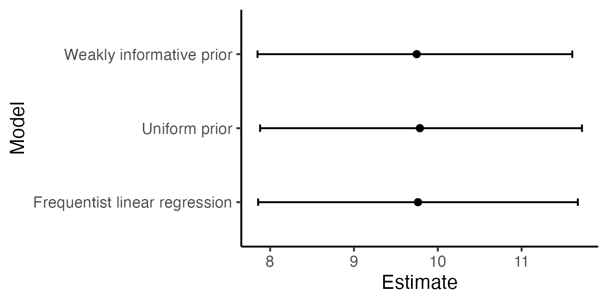
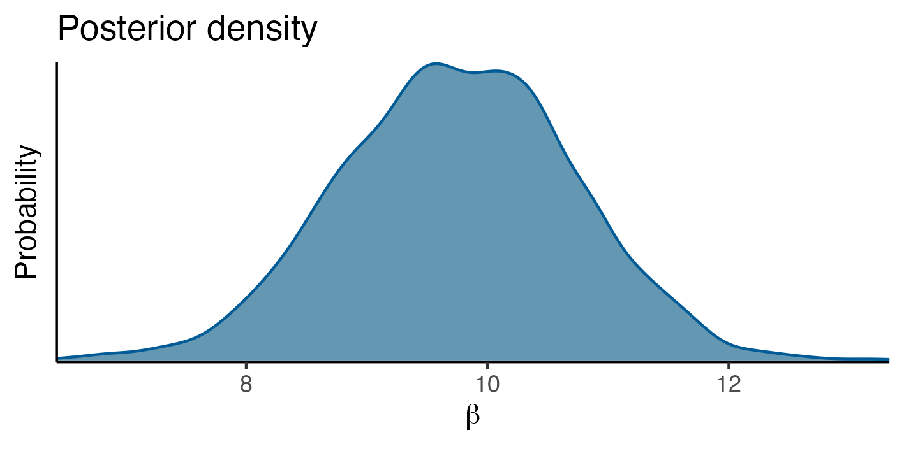

# Outline for Part I

- A brief history

- Two ways of quantifying evidence - Bayesianism vs frequentism

- Short break (5 min)

- Priors and posteriors - a complete example with Bayesian linear regression


---

Also need some R packages.

```{r, message=FALSE}
library(tidyverse)
theme_set(theme_classic())
```


---

# Thomas Bayes (1701 - 1761)

<center>

</center>

---
class: middle, center


---

# Bayes' theorem

> If there be two subsequent events, the probability of the second b/N and the probability of both together P/N, and it being first discovered that the second event has also happened, from hence I guess that the first event has also happened, the probability I am right is P/b.

With symbols<sup>1</sup>

$$P(A|B) = \frac{P(A \cap B)} {P(B)}$$
- $P(B)$: probability that the second event happens.
- $P(A \cap B)$: probability that both events happens.
- $P(A)$: probability that the first event happens.


.footnote[<sup>1</sup>Stigler, S.M. (1982), Thomas Bayes's Bayesian Inference. Journal of the Royal Statistical Society: Series A (General), 145: 250-258. https://doi.org/10.2307/2981538.]


---

# Bayes' theorem

Considering Bayes' theorem again

$$P(A|B) = \frac{P(A \cap B)} {P(B)}$$
We know that $P(A \cap B) = P(B \cap A)$, since "A and B happen" is the same as "B and A happen". 
--
Hence, we also have

$$P(B|A) = \frac{P(B \cap A)}{P(A)} = \frac{P(A \cap B)}{P(A)}$$
--
By some replacement, it follows that

$$P(A|B) = \frac{P(B|A)P(A)}{P(B)}$$

---

# An application of Bayes' theorem

<center>

</center>


---

# An application of Bayes' theorem

For a random person taken from the population, what is the probability of disease (event $A$) given positive test (event $B$)?
--

- Sensitivity: $P(B|A)$, (positive test given sick). 

- Base rate: $P(A)$ (sick). 

- Positive test: $P(B) = P(B|\bar{A}) + P(B|A) = \{1-P(\bar{B}|\bar{A})\} + P(B|A)$.

  - $P(\bar{B}|\bar{A})$ is the specificity (negative test given not sick).

--

We get the probability of being sick given a positive test:

$$P(A|B) = \frac{P(B|A)P(A)}{1-P(\bar{B}|\bar{A}) + P(B|A)}$$

- All statisticians agree about this.

---

class: middle, center 

# Bayesian vs Frequentist statistics


---

# Example - ToothGrowth data

- Consider a simple dataset, `ToothGrowth`, which comes with `R`.

```{r}
data("ToothGrowth")
head(ToothGrowth)
```

- `len` is length of tooth in guinea pigs.

- `dose` is daily dose of vitamin C (mg/day)


---

# Visualization

```{r, fig.height=3, fig.width=5, dev='svg'}
ggplot(ToothGrowth, aes(x = dose, y = len)) + 
  geom_point()
```


There seems to be a positive relationship, but how do we quantify our uncertainty?

---

# Linear regression

A linear regression will quantify how much evidence we have:

```{r}
linreg <- lm(len ~ dose, data = ToothGrowth)
```


```{r}
library(broom)
tidy(linreg)
```

---

# Interpretation of p-values

How do we interpret the p-value $1.23 \times 10^{-14}$ for the estimated effect $\hat{\beta}=9.76$?

--

We have two hypotheses:

- H0: No effect of vitamin C on tooth growth, $\beta=0$.

- H1: Effect of vitamin C on tooth growth, $\beta \neq 0$.

--

And we can say:

- Assume H0 is true. If we take random samples of this size from the populations a very large number of times, the proportion of samples for which our estimate $|\hat{\beta}| > 9.76$ would go towards $1.23 \times 10^{-14}$ (0.00000000000123 %).

Hence, under H0 the expected **frequency** of seeing a deviation this big is $1.23 \times 10^{-14}$.


---

# Interpretation of confidence intervals

```{r}
confint(linreg)
```


- A 95% confidence interval is a thing which - when we repeatedly take random samples from the population - will contain the true value about 95% of the times.


---

# Bayesian linear regression

We have a linear model for the `ToothGrowth` data: 

$$\text{length} = \beta_{0} + \beta \times \text{dose} + \epsilon$$

---

# Bayesian linear regression

How can we use Bayes' theorem to say something about $\beta$?

$$p(\beta | \text{data}) = \frac{p(\beta) p(\text{data}|\beta)}{ p(\text{data})}$$

1. Our prior knowledge: $p(\beta)$

2. How likely it is to see the data we observed, for any given value of $\beta$: $p(\text{data}|\beta)$

3. Normalizing constant: $p(\text{data})$.


1 + 2 + 3 give us $p(\beta|\text{data})$, the probability of any given $\beta$, taking the evidence in our data into account.

.footnote[We actually need to say something about the residual standard deviation as well, but we'll deal with that later.]


---

class: middle, center

# Let's look at this piece by piece

---

# Piece 1 - The Prior

The prior, $p(\beta)$, quantifies our prior knowledge about the effect under study. Must be defined **before** looking at the data, just like tests in a frequentist analysis must predefined to avoid p-hacking.

---

# Piece 1 - The Prior

Assume we consider the biological nature of the problem, and find that $\beta$-values below -60 or above 60 are extremely unlikely. We also do not have any prior knowledge about the direction of the effect. 

A convenient choice may then be a normal distribution with mean 0 and standard deviation $\sigma = 30$. Then $p(|\beta| > 60) = 0.05$.

```{r, echo=FALSE, fig.height=3, fig.width=5, dev='svg'}
tibble(beta = seq(from = -60, to = 60, by = 1)) %>% 
  mutate(p = dnorm(beta, sd = 25)) %>% 
  ggplot(aes(x = beta, y = p)) + 
  geom_line() + 
  ggtitle("Weakly informative prior") + 
  xlab(expression(beta)) + 
  ylab("Probability")
```


---

# Noninformative prior

Sometimes we have no idea, or we want to be "objective". Can use a uniform prior. Every possible value of $\beta$ has a very very slight positive probability.

```{r, echo=FALSE, fig.height=3, fig.width=5, dev='svg'}
tibble(beta = seq(from = -1000, to = 1000, by = 1)) %>% 
  mutate(p = dunif(beta, min = -1000, max = 1000)) %>% 
  ggplot(aes(x = beta, y = p)) + 
  geom_line() + 
  ggtitle("Uniform prior") + 
  xlab(expression(beta)) + 
  ylab("Probability")
```

---

# Likelihood

$p(\text{data} | \beta)$ is the likelihood. It is related to the residual sum of squares

$$RSS(\beta) = -\sum_{i=1}^{n} \{y_{i} - (\beta_{0} + \beta x_{i})\}^2$$ 

.pull-left[

```{r, echo=FALSE, fig.width=5, fig.height=3, dev='svg'}
plot_df <- ToothGrowth %>% 
  mutate(beta0 = 7.4225, beta = list(seq(from = 3, to = 15, by = .1))) %>% 
  unnest(cols = beta) %>% 
  mutate(yhat = beta0 + beta * dose) %>% 
  group_by(beta) %>% 
  summarise(rss = mean((len - yhat)^2), .groups = "drop")

ggplot(plot_df, aes(x = beta, y = rss)) + 
  geom_line() + 
  xlab(expression(beta)) +
  ylab("Residual sum of squares") 
```
]
.pull-right[
```{r, echo=FALSE, fig.width=5, fig.height=3, dev='svg'}
ggplot(plot_df, aes(x = beta, y = exp(-rss))) + 
  geom_line() + 
  geom_point(data = tibble(beta = coef(linreg)[[2]], rss = mean(residuals(linreg)^2))) +
  xlab(expression(beta)) +
  ylab(latex2exp::TeX("$p(data|\\beta)$")) 
```


]


---

layout: false

# Example - Bayesian version

The final piece is the normalizing constant, $p(\text{data})$:

$$p(\beta | \text{data}) = \frac{p(\beta) p(\text{data}|\beta)}{ p(\text{data})}$$

Luckily, it does not contain $\beta$, so it's value does not affect our estimate of $\beta$. We write

$$p(\beta | \text{data}) \propto p(\beta) p(\text{data}|\beta)$$
and let the software deal with it.

---

# Example - Bayesian version

The funny sign $\propto$ means *is proportional to*, and the lack of a normalizing constant means that we can get *unnormalized* probabilities:

```{r, echo=FALSE}
tibble(beta = c(1, 2, 3), Probability = c(4.5, 9, 7)) %>% 
  knitr::kable()
```


--

Normalization is straightforward in this case:

```{r, echo=FALSE}
tibble(beta = c(1, 2, 3), Probability = c(4.5, 9, 7)) %>% 
  mutate(`Normalized prob.` = Probability / sum(Probability)) %>% 
  knitr::kable(digits = 2)
```


---

## Example - Bayesian version

- Back to our linear regression. We have described the likelihood $p(\text{data}|\beta)$, priors $p(\beta)$, and the normalizing constant $p(\text{data})$. 

- It all looks pretty similar.




---

## Example - Bayesian version

- However, Bayesian models let us do much more afterwards, like plotting $p(\beta | \text{data})$



---

## Example - Bayesian version

- Or asking: What is the probability that the true value of $\beta$ is larger than 10?

- Which turns out to be 40.7 %.

---

class: center, middle


# Thanks!

Slides created via the R package [**xaringan**](https://github.com/yihui/xaringan).

The chakra comes from [remark.js](https://remarkjs.com), [**knitr**](https://yihui.org/knitr/), and [R Markdown](https://rmarkdown.rstudio.com).
