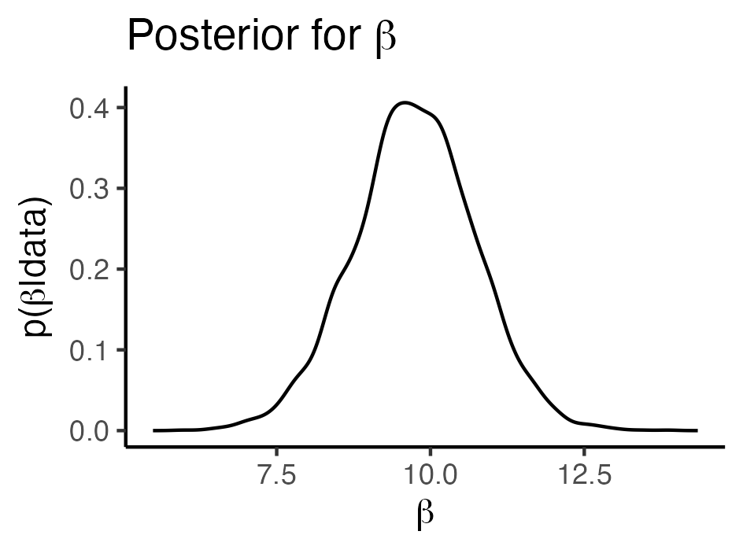
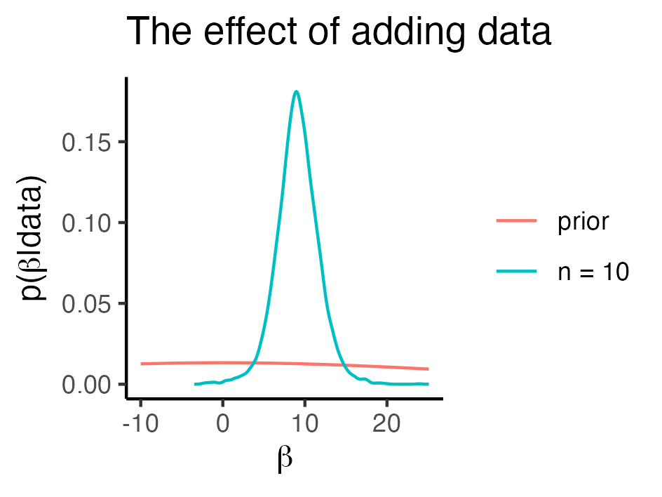

```{r, echo=FALSE}
knitr::opts_chunk$set(fig.align = "center")
knitr::opts_chunk$set(cache = TRUE)
```


# Who Am I?

- Associate professor in statistics at the Department of Psychology, University of Oslo.

- PhD in Biostatistics from 2015.

- Pragmatic user of both Bayesian and classical statistical methods.


---


# Plan for the Day

| Time | What |
| --- | --- |
| 10:00 - 11:30 | Part I - Introduction to Bayesian Statistics |
| 11:30 - 12:30 | Lunch |
| 12:30 - 14:00 | Part II - Bayesian Workflow for Data Analysis |
| 14:15 - 15:15 | Part III - Bayesian Analysis with R |
| 15:30 - 17:00 | Exercises with "brms" in R |


- Please remember, comments and questions are **always** welcome!

- Presentations and other course material available at https://osorensen.github.io/BayesCourseEPINOR2021/


---

# Setup

For the R code in the presentations to work, we must run the following lines:

```{r, message=FALSE}
library(tidyverse)
theme_set(theme_classic())
```


.footnote[Wickham et al., (2019). Welcome to the Tidyverse. Journal of Open Source Software, 4(43), 1686, https://doi.org/10.21105/joss.01686]


---

class: inverse, middle, center

# Part I - Introduction to Bayesian Statistics

---


# Outline for Part I

- A brief history

- Two ways of quantifying evidence - Bayesianism vs frequentism

- Short break (5 min)

- Priors and posteriors - a complete example with Bayesian linear regression


---

# Thomas Bayes (1701 - 1761)

<center>

</center>

---
class: inverse, middle, center


---

# Bayes' theorem

> If there be two subsequent events, the probability of the second b/N and the probability of both together P/N, and it being first discovered that the second event has also happened, from hence I guess that the first event has also happened, the probability I am right is P/b.

With symbols

$$P(A|B) = \frac{P(A \cap B)} {P(B)}$$
- $P(B)$: probability that the second event happened.
- $P(A \cap B)$: probability that both events happened.
- $P(A|B)$: probability that the first event happened, given that the second has happened.


.footnote[Stigler, S.M. (1982), Thomas Bayes's Bayesian Inference. Journal of the Royal Statistical Society: Series A (General), 145: 250-258. https://doi.org/10.2307/2981538.]


---

# Bayes' theorem

Considering Bayes' theorem again

$$P(A|B) = \frac{P(A \cap B)} {P(B)}$$
We know that $P(A \cap B) = P(B \cap A)$, since "A and B happened" is the same as "B and A happened". 
--
Hence, we also have

$$P(B|A) = \frac{P(B \cap A)}{P(A)} = \frac{P(A \cap B)}{P(A)}$$
--
By some replacement, it follows that

$$P(A|B) = \frac{P(B|A)P(A)}{P(B)}$$

---

# An application of Bayes' theorem

<center>

</center>


---

# An application of Bayes' theorem

For a random person taken from the population, what is the probability of disease (event $A$) given positive test (event $B$)?
--

- Sensitivity: $P(B|A)$, (positive test given sick). 

- Prevalence: $P(A)$. 

- Positive test $P(B)$: 

--

  - Hard enough to deserve it's own slide.
  
  
---
  
# Positive test

- Total probability equals probability given sick plus probability given not sick. $\bar{A}$ means "not A": 
  
$$P(B) = P(B|\bar{A}) + P(B|A)$$
--

- If you are not sick, you can either get a positive test $B$ or a negative test $\bar{B}$, so

$$P(B|\bar{A}) + P(\bar{B}|\bar{A}) = 1$$
$$P(B|\bar{A}) = 1- P(\bar{B}|\bar{A})$$
  
--
  
- We thus get 

$$P(B) = \underbrace{\{1 - P(\bar{B}|\bar{A})\}}_{P(B|\bar{A})} + P(B|A)$$
  
  
---

# An application of Bayes' theorem


We get the probability of being sick given a positive test:

$$P(A|B) = \frac{P(B|A)P(A)}{P(B)} = \frac{P(B|A)P(A)}{1-P(\bar{B}|\bar{A}) + P(B|A)}$$

--

Why useful?

$$\text{unknown thing} = \text{formula with known things} $$
Known things:

  - Sensitivity $P(B|A)$
  
  - Prevalence $P(A)$
  
  - Specificity $P(\bar{B}|\bar{A})$


---

# Bayes and Statistics

From 1761 and 200 years forward, Bayes' work did not have much influence on data analysis.


---

# Bayes and Statistics

Statistics at the time was about counting.

.pull-left[

]
.pull-right[

]

.footnote[Pictures from https://no.wikipedia.org/wiki/John_Snow]


---

# Bayes and Statistics

- Modern statistics founded by people like Karl Pearson, Sir Ronald Fisher, Egon Pearson, and Jerzy Neyman early in the 20th century.

- So-called frequentist statistics, which is what most of you probably are most familiar with.


---

class: inverse, middle, center 

# Bayesian vs Frequentist Statistics


---

# Example - ToothGrowth data

- Consider a simple dataset, `ToothGrowth`, which comes with `R`.

```{r}
data("ToothGrowth")
head(ToothGrowth)
```

- `len` is length of tooth in guinea pigs.

- `dose` is daily dose of vitamin C (mg/day)


---

# Visualization

```{r, fig.height=3, fig.width=5, dev='svg'}
ggplot(ToothGrowth, aes(x = dose, y = len)) + 
  geom_point()
```

???
There seems to be a positive relationship, but how do we quantify our uncertainty?

---

# Linear Regression

Linear regression estimates effect of dose on length.

```{r}
linreg <- lm(len ~ dose, data = ToothGrowth)
```


```{r}
library(broom)
tidy(linreg)
```

.footnote[David Robinson, Alex Hayes and Simon Couch (2021). broom: Convert Statistical Objects into Tidy Tibbles. R package version 0.7.9. https://CRAN.R-project.org/package=broom]

---

# Interpretation of p-values

How do we interpret the p-value $1.23 \times 10^{-14}$ for the estimated effect $\hat{\beta}=9.76$?

--

We have two hypotheses:

- H0: No effect of vitamin C on tooth growth, $\beta=0$.

- H1: Effect of vitamin C on tooth growth, $\beta \neq 0$.

--

And we can say:

- If H0 is true and we take very many random datasets from the population, the magnitude $|\hat{\beta}|$ would exceed 9.76 about $1.23 \times 10^{-14}$ (0.00000000000123 %) of the times.

Hence, under H0 the expected **frequency** of seeing a deviation this big is $1.23 \times 10^{-14}$.


---

# Significance Testing

Magic 5 % cutoff for significance.

<center>

</center>

.footnote[Cowles, M., & Davis, C. (1982). On the origins of the .05 level of statistical significance. American Psychologist, 37(5), 553–558. https://doi.org/10.1037/0003-066X.37.5.553]

---

# Some Points for Discussion

- Is it ever possible that the null hypothesis is literally true? 

  - Think of linear regression $y = \beta_{0} + \beta x + \epsilon$ as an example, where $x$ is some exposure and $y$ is some outcome.

--

- What happens to p-values as we increase the sample size?

---

# Confidence intervals

```{r}
confint(linreg)
```


- A 95% confidence interval is a thing which - when we repeatedly take random samples from the population - will contain the true value about 95% of the times.


---

# Bayesian linear regression

We have a linear model for the `ToothGrowth` data:

$$y = \beta_{0} + \beta x + \epsilon$$

$y$ is the length and $x$ is the dose.

---

# Bayesian linear regression

Can we use Bayes' theorem to say something about $\beta$?

$$\underbrace{p(\beta | \text{data})}_{\color{red}{\text{want to know}}} = \underbrace{\frac{p(\beta) p(\text{data}|\beta)}{ p(\text{data})}}_{\color{red}{\text{know?}}}$$

"data" is just a shorthand for "observed lengths at given doses".


--

1. Our prior knowledge: $p(\beta)$

2. How likely it is to see the data we observed, for any given value of $\beta$: $p(\text{data}|\beta)$

3. Normalizing constant: $p(\text{data})$.


---

class: inverse, middle, center

# Piece by piece

---

# Piece 1 - The Prior

- Quantifies our prior knowledge about the effect under study. 

- Should be defined **before** looking at the data, just like tests in a frequentist analysis should predefined to avoid p-hacking.

  - That being said, just like in frequentist analysis, we should examine whether the model is a good fit to the data, compare different models, etc.

- For some reflections on how to preregister a Bayesian analysis, see Schad et al. (2020), p. 106.
  
  
.footnote[Schad, Daniel J., Michael Betancourt, and Shravan Vasishth. “Toward a Principled Bayesian Workflow in Cognitive Science.” Psychological Methods, 2020. https://doi.org/10.1037/met0000275.]


---

# Piece 1 - The Prior

Assume we consider the biological nature of the problem, and find that $\beta$-values below -60 or above 60 are extremely unlikely. We also do not have any prior knowledge about the direction of the effect.

--

A convenient choice may then be a normal distribution with mean 0 and standard deviation $\sigma = 30$. Then $p(|\beta| > 60) = 0.05$.

```{r, echo=FALSE, fig.height=3, fig.width=5, dev='svg'}
p <- tibble(beta = seq(from = -60, to = 60, by = 1)) %>% 
  mutate(p = dnorm(beta, sd = 25)) %>% 
  ggplot(aes(x = beta, y = p)) + 
  geom_line() + 
  ggtitle("Weakly informative prior") + 
  xlab(latex2exp::TeX("Potential values of $\\beta$")) + 
  ylab("Probability")
p
```


---

# Piece 1 - The Prior

In the words of Greenland (2006), when the only parameter of interest is a  risk ratio

> ... my 95% prior limits are a pair of numbers $RR_{lower}$ and $RR_{upper}$ such that I would give $95 : 5 =  19:1$ odds that the true risk ratio is between these numbers, i.e. $P(RR_{lower} \leq RR \leq RR_{upper}) = 0.95$ if I disregarded the analysis data.


.footnote[Greenland, Sander. “Bayesian Perspectives for Epidemiological Research: I. Foundations and Basic Methods.” International Journal of Epidemiology 35, no. 3 (June 1, 2006): 765–75. https://doi.org/10.1093/ije/dyi312.]

---

# Piece 1 - The Prior

Following Greenland, our normal prior for $\beta$ implies that we would give 19:1 odds that the true slope is between -60 and 60.

```{r, echo=FALSE, fig.height=3, fig.width=5, dev='svg'}
p
```

---

# Noninformative prior

Sometimes we have no idea, or we want to be "objective". Can use a uniform prior. Every possible value of $\beta$ has a very very slight positive probability.

```{r, echo=FALSE, fig.height=3, fig.width=5, dev='svg'}
tibble(beta = seq(from = -1000, to = 1000, by = 1)) %>% 
  mutate(p = dunif(beta, min = -1000, max = 1000)) %>% 
  ggplot(aes(x = beta, y = p)) + 
  geom_line() + 
  ggtitle("Uniform prior") + 
  xlab(latex2exp::TeX("Potential values of $\\beta$")) + 
  ylab("Probability")
```

---

# Piece 2 - The Likelihood


.pull-left[

$p(\text{data} | \beta)$ is the likelihood. For linear regression it is related to the residual sum of squares

$$RSS(\beta) = \sum_{i=1}^{n} \{y_{i} - (\beta_{0} + \beta x_{i})\}^2$$ 

### Discussion point

- What is the red dot? Is it related to frequentist linear regression?


]
.pull-right[


```{r, echo=FALSE, fig.width=5, fig.height=6, dev='svg'}
library(patchwork)

plot_df <- ToothGrowth %>% 
  mutate(beta0 = 7.4225, beta = list(seq(from = 3, to = 15, by = .1))) %>% 
  unnest(cols = beta) %>% 
  mutate(yhat = beta0 + beta * dose) %>% 
  group_by(beta) %>% 
  summarise(rss = mean((len - yhat)^2), .groups = "drop")

p1 <- ggplot(plot_df, aes(x = beta, y = rss)) + 
  geom_line() + 
  geom_point(data = filter(plot_df, rss == min(rss)), color = "red", size = 2) + 
  xlab(latex2exp::TeX("Potential values of $\\beta$")) +
  ylab(latex2exp::TeX("Residual sum of squares")) 

p2 <- ggplot(plot_df, aes(x = beta, y = exp(-rss))) + 
  geom_line() + 
  geom_point(data = tibble(beta = coef(linreg)[[2]], rss = mean(residuals(linreg)^2)),
             color = "red", size = 2) +
  xlab(latex2exp::TeX("Potential values of $\\beta$")) +
  ylab("Likelihood") 

p1 + p2 + plot_layout(ncol = 1)
```


]


---

layout: false

# Piece 3 - Normalizing Constant

The final piece is the normalizing constant, $p(\text{data})$:

$$p(\beta | \text{data}) = \frac{p(\beta) p(\text{data}|\beta)}{ p(\text{data})}$$

Luckily, it does not contain $\beta$, so it's value does not affect our estimate of $\beta$. We write

$$p(\beta | \text{data}) \propto p(\beta) p(\text{data}|\beta)$$
and let the software deal with it.

---

# Piece 3 - Normalizing Constant

The funny sign $\propto$ means *is proportional to*, and the lack of a normalizing constant means that we can get *unnormalized* probabilities. Example:

```{r, echo=FALSE}
tibble(beta = c(1, 2, 3), Probability = c(4.5, 9, 7)) %>% 
  knitr::kable()
```


--

Normalization is straightforward in this case. We must divide each number by 4.5+9+7=20.5:

```{r, echo=FALSE}
tibble(beta = c(1, 2, 3), Probability = c(4.5, 9, 7)) %>% 
  mutate(`Normalized prob.` = Probability / sum(Probability)) %>% 
  knitr::kable(digits = 2)
```


---

# Example - Bayesian version

- Back to our linear regression. We have described the likelihood $p(\text{data}|\beta),$ priors $p(\beta),$ and the normalizing constant $p(\text{data})$. 

- Estimates and confidence intervals look similar:


---

# Posterior Distribution

- However, Bayesian models let us do much more afterwards, like plotting $p(\beta | \text{data})$

<center>

</center>

---

# Posterior Distribution

- Or asking: What is the probability that the true value of $\beta$ is larger than 10?


<center>

</center>

$$p(\beta > 10| \text{data}) = 0.4$$

---

# Posterior Distribution

Again back to Greenland

> The 50th percentile (median) of my posterior (...) is a number $RR_{median}$ for which $P(RR \geq RR_{median} | data) =P(RR \leq RR_{median} | data)$, where (...) this bet is formulated in light of the analysis data. 

> Similarly, my 95% posterior limits are a pair of numbers $RR_{lower}$ and $RR_{upper}$ such that after analysing the data I would give $95:5=19:1$ odds that the true relative risk is between these numbers, i.e. $P(RR_{lower} \leq RR \leq RR_{upper} | data) = 0.95$.

This is the typical Bayesian interpretation of probability. Long term frequency under the null hypothesis is not mentioned.

---

# Posterior Confidence Interval

The 95 % posterior interval for $\beta$, $[7.8, 11.7]$, are such that after analyzing the data, we would give $19:1$ odds that the true effect is between these two numbers.

<center>

</center>


---
layout: true

# What's the effect of adding data?

---

<center>

</center>

---

<center>

</center>

---

<center>

</center>

---

<center>

</center>

---

<center>

</center>


---
layout: false
class: inverse, middle, center

# Summary of Bayesian vs Frequentist Statistics


---

# Bayesian vs Frequentist Statistics

- Frequentist

  - p-values interpreted in light of "how often would this happen if H0 was true and we sampled data again and again"?
  
  - Similarly for confidence intervals
  
- Bayesian

  - Posterior distribution quantifies our degree of belief after seeing the data. Should agree with frequentist values if we sample data again and again.
  
  - Requires specifying the prior distribution, and works less out-of-the-box.
  


---

class: center, middle


# Thanks!

Slides created via the R package [**xaringan**](https://github.com/yihui/xaringan).

The chakra comes from [remark.js](https://remarkjs.com), [**knitr**](https://yihui.org/knitr/), and [R Markdown](https://rmarkdown.rstudio.com).
