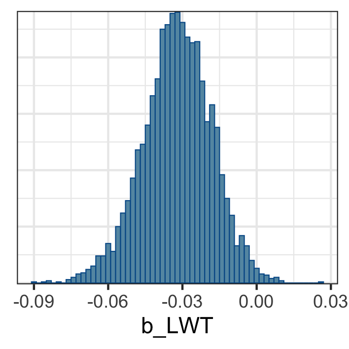
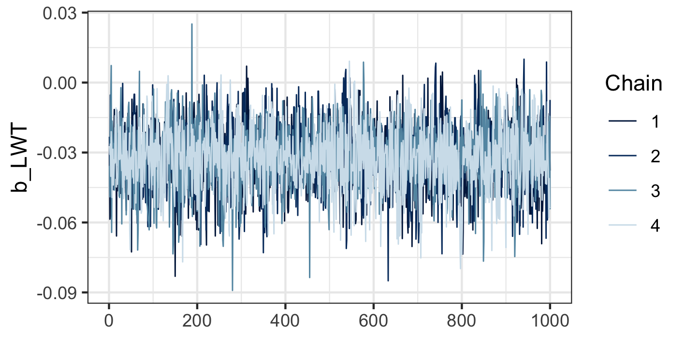

```{r, echo=FALSE}
knitr::opts_chunk$set(fig.align = "center")
knitr::opts_chunk$set(cache = TRUE)
```

```{r, echo=FALSE, message=FALSE}
library(tidyverse)
library(gghalves)
theme_set(theme_bw())
library(latex2exp)
```


---

class: inverse, middle, center

# Part II - Bayesian Workflow for Data Analysis

```{r, message=FALSE, echo=FALSE}
library(tidyverse)
theme_set(theme_classic())
```


---

# Workflow?

.pull-left[

### Idealized case

- Preregister hypotheses to be tested.

- Get the data.

- Fit models. Perform model selection based on recipe defined at preregistration.

- Report confidence intervals and p-values for tests that were preregistered.

]
--
.pull-right[

### Real life?

1. Have some questions you want to investigate.

2. Exploratory data analysis.

3. Try to fit some models, but it crashes. Realize that the model you planned won't work that way. Go back to 1. and repeat.

4. Find some interesting patterns that you hadn't thought of. Is it signal or noise?

5. Go back and forth for a while, then submit paper.

]

---

# Bayesian Workflow?

Gelman et al. (2021) write

> Using Bayesian inference to solve real-world problems requires not only statistical skills, subject matter knowledge, and programming, but also awareness of the decisions made in the process of data analysis. All of these aspects can be understood as part of a tangled workflow of applied Bayesian statistics.


.footnote[Gelman, A., Vehtari, A., Simpson, D., Margossian, C. C., Carpenter, B., Yao, Y., Kennedy, L., Gabry, J., Bürkner, P.-C., & Modrák, M. (2020). Bayesian Workflow. ArXiv:2011.01808 [Stat]. http://arxiv.org/abs/2011.01808]


---

# Phases of a Statistical Workflow

(a) Exploratory data analysis to aid in choosing initial model.

(b) Quantify prior knowledge.

(c) Check that the computations work correctly.

(d) Check that the model fits the data well.

(e) Compare to other more or less complicated models.

.footnote[Gabry, J., Simpson, D., Vehtari, A., Betancourt, M., & Gelman, A. (2019). Visualization in Bayesian workflow. Journal of the Royal Statistical Society: Series A (Statistics in Society), 182(2), 389–402. https://doi.org/10.1111/rssa.12378]


---

# Birth Weight Data

Data from Low Birth Weight Study, used by Hosmer and Lemeshow (2000).


```{r}
dat <- readRDS("data/bwt.rds")
head(dat)
```


.footnote[David W. Hosmer and Stanley Lemeshow (2000). Applied Logistic Regression, Second Edition. John Wiley & Sons, Inc. ISBN:9780471356325. https://doi.org/10.1002/0471722146]


---

# Birth Weight Data

```{r}
head(dat)
```

- **Low**: Did the child have birth weight below 2500 grams?
- **Age**: Age of mother.
- **LWT**: Weight of mother at last menstrual period (kg).
- **Smoker**: Does mother smoke?
- **Hypertension**: Does mother have high blood pressure?

---

# Birth Weight Data

Research question:

- Is weight of mother at last menstrual period related to whether the child has birth weight below 2500 grams?

Possible confounding factors are age, smoking status, and hypertension.


---

# (a) Exploratory data analysis

Goals:

- Plotting the data helps reveal if something is completely wrong

  - e.g., missing values coded as -999
  
- Might show patterns of relevance to modeling

  - at the risk of p-hacking, but there is always a tradeoff here


---

# (a) Exploratory data analysis

Some tendency that women with higher weight have lower probability of low birthweight?

```{r, dev='svg', fig.align='center', fig.height=3, fig.width=5, echo=FALSE}
df1 <- dat %>% 
  mutate(LWT = cut_number(LWT, n = 5)) %>% 
  group_by(LWT) %>% 
  summarise(prop_low = mean(Low), n = n(), .groups = "drop")

ggplot(df1, aes(x = LWT, y = prop_low)) +  
  geom_point() + 
  geom_text(aes(label = n), color = "red", hjust = 1.3) + 
  theme(legend.position = "none") + 
  xlab("Weight") + 
  ylab("Proportion with low birthweight")
```

.footnote[Number of observations in each group indicated in red.]

---

# (a) Exploratory data analysis


Does stratifying by smoking status change the relationship?

```{r, dev='svg', fig.align='center', fig.height=3, fig.width=7, echo=FALSE}
df2 <- dat %>% 
  mutate(LWT = cut_number(LWT, n = 5)) %>% 
  group_by(LWT, Smoker) %>% 
  summarise(prop_low = mean(Low), n = n(), .groups = "drop")

ggplot(df2, aes(x = LWT, y = prop_low)) +  
  geom_point() + 
  geom_point(data = df1, color = "gray") +
  geom_text(hjust = 1.3, color = "red", aes(label = n)) + 
  theme(legend.position = "none") + 
  facet_wrap(vars(Smoker), labeller = as_labeller(function(x) paste("Smoker:", x))) + 
  xlab("Weight") + 
  ylab("Proportion with low birthweight")
```

.footnote[Values from last slide in gray.]


---

# (a) Exploratory data analysis


What about hypertension?


```{r, dev='svg', fig.align='center', fig.height=3, fig.width=7, echo=FALSE}
dat %>% 
  mutate(LWT = cut_number(LWT, n = 5)) %>% 
  group_by(LWT, Hypertension) %>% 
  summarise(prop_low = mean(Low), n = n(), .groups = "drop") %>% 
  ggplot(aes(x = LWT, y = prop_low, label = n)) +  
  geom_point() + 
  geom_text(hjust = 1.3, color = "red") + 
  theme(legend.position = "none") + 
  facet_wrap(vars(Hypertension), labeller = as_labeller(function(x) paste("Hypertension:", x))) + 
  xlab("Weight") + 
  ylab("Proportion with low birthweight")
```


---

# (a) Exploratory data analysis

Hard to claim that there is a relationship between age and low birthweight:

```{r, dev='svg', fig.align='center', fig.height=3, fig.width=5, echo=FALSE}
dat %>% 
  mutate(Age = cut_number(Age, n = 5)) %>% 
  group_by(Age) %>% 
  summarise(
    prop_low = mean(Low), n = n(), .groups = "drop"
  ) %>% 
  ggplot(aes(x = Age, y = prop_low)) + 
  geom_point() + 
  theme(legend.position = "none") + 
  ylab("Proportion with low birthweight")
```

---

# (a) Exploratory data analysis

Logistic regression model seems appropriate.

- Initial model of the form using LWT as explanatory variable.

- We believe that smoking status might be an important covariate to include.

- Will also include age, so the most complex model also includes Smoking status and Age.


---

# (a) Exploratory data analysis

The plots shown above may not have given too much information on how to build the model, but there are cases where it could have been crucial. 

These simulated plots show such a situation:

```{r, echo=FALSE}
sim_df <- crossing(
  Weight = c("(40, 50]", "(50, 60]", "(60, 70]", "(70, 80]"),
  Smoker = c(FALSE, TRUE)
) %>% 
  mutate(n = c(80, 1, 60, 2, 20, 4, 20, 8))
  
sim_df1 <- sim_df %>% 
  group_by(Weight) %>% 
  summarise(n = sum(n), .groups = "drop") %>% 
  mutate(n = n / sum(n))

p1 <- ggplot(sim_df1, aes(x = Weight, y = n)) +  
  geom_point() + 
  theme(legend.position = "none") + 
  xlab("Weight") + 
  ylab("Proportion with low birthweight")

p2 <- sim_df %>% 
  group_by(Smoker) %>% 
  mutate(n = n/sum(n)) %>% 
  ungroup() %>% 
  ggplot(aes(x = Weight, y = n, color = Smoker)) +  
  geom_point() + 
  xlab("Weight") + 
  ylab("Proportion with low birthweight")

```

.pull-left[
```{r, dev='svg', fig.align='center', fig.height=4, fig.width=5, echo=FALSE}
p1
```
]
--
.pull-right[
```{r, dev='svg', fig.align='center', fig.height=4, fig.width=5, echo=FALSE}
p2
```

]

--

Interaction might be useful?


---

# (b) Quantify prior knowledge

Prior predictive simulations:

- Giving values to the parameters of the prior distribution is hard. We can circumvent the problem by rather looking at what type of data are implied by the prior.


---

# (b) Quantify prior knowledge

- Logistic regression model

$$P(Low) = \text{logit}\left(\beta_{0} + \beta_{LWT} LWT\right)$$

- Consider two mothers, whose weights are $LWT_{1}$ and $LWT_{2}$. The odds ratio of low birthweight between mother 1 and mother 2 is

$$\exp\left\{(LWT_{1}-LWT_{2}) \beta_{LWT}\right\} = \exp\left\{\Delta_{W} \beta_{LWT}\right\}$$
- We can use this to find a reasonable prior distribution for $\beta_{LWT}$.


---

# (b) Quantify prior knowledge

An example to make what's coming seem more sensible. 

Assuming $\beta_{LWT}=-0.10$, we can make the following plot to interpret the effect:

```{r, echo=FALSE}
plot_df <- tibble(
  delta_w = seq(from = -10, to = 10, by = 1),
  odds_ratio = exp(-.1 * delta_w)
)
```

.pull-left[
```{r, dev='svg', fig.align='center', fig.height=3, fig.width=3, echo=FALSE}
ggplot(plot_df, aes(x = delta_w, y = odds_ratio)) + 
  geom_line() +
  xlab("Weight difference") + 
  ylab("Odds ratio")
```
]
.pull-right[
```{r, dev='svg', fig.align='center', fig.height=3, fig.width=3, echo=FALSE}
ggplot(plot_df, aes(x = delta_w, y = odds_ratio)) + 
  geom_line() +
  scale_y_log10() +
  xlab("Weight difference") + 
  ylab("Log odds ratio")
```
]


---

# (b) Quantify prior knowledge

Let's start by assuming a very wide prior distribution for $\beta_{LWT}$<sup>1</sup>. Normal with mean 0 and standard deviation 100.

```{r, dev='svg', fig.align='center', fig.height=3, fig.width=5, echo=FALSE}
tibble(beta = seq(from = -300, to = 300, by = 1)) %>% 
  mutate(prob = dnorm(beta, sd = 100)) %>% 
  ggplot(aes(x = beta, y = prob)) + 
  geom_line() +
  xlab(TeX("$\\beta$")) + 
  ylab(TeX("$P(\\beta)$"))
```

We would give 19:1 odds that the true $\beta_{LWT}$ is between -200 and +200. And 1:1 odds that $\beta_{LWT}$ is below or above 0.

.footnote[<sup>1</sup>This is a very common thing to do.]

---

# (b) Quantify prior knowledge

Continuing with our wide prior distribution, here is what it means in terms of odds ratios:

```{r, echo=FALSE}
plot_df <- crossing(
  delta_w = seq(from = -10, to = 10, by = 1),
  beta = c(-200, 0, 200)
  ) %>% 
  mutate(odds_ratio = exp(beta * delta_w))
```

.pull-left[
```{r, dev='svg', fig.align='center', fig.height=3, fig.width=4, echo=FALSE}
ggplot(plot_df, aes(x = delta_w, y = odds_ratio, group = factor(beta), color = factor(beta))) + 
  geom_line() +
  xlab("Weight difference") + 
  ylab("Odds ratio") + 
  labs(color = TeX("$\\beta$"))
```
]
.pull-right[
```{r, dev='svg', fig.align='center', fig.height=3, fig.width=4, echo=FALSE, warning=FALSE}
ggplot(plot_df, aes(x = delta_w, y = odds_ratio, group = factor(beta), color = factor(beta))) + 
  geom_line() +
  scale_y_log10() +
  xlab("Weight difference") + 
  ylab("Log odds ratio") +
  labs(color = TeX("$\\beta$"))
```
]

We would probably give more than 19:1 odds that the odds ratio is lower than this!


---

# (b) Quantify prior knowledge

We can try to be a bit more informative. Let the prior be normal with mean 0 and standard deviation 1.

```{r, dev='svg', fig.align='center', fig.height=3, fig.width=5, echo=FALSE}
tibble(beta = seq(from = -3, to = 3, length.out = 100)) %>% 
  mutate(prob = dnorm(beta, sd = 1)) %>% 
  ggplot(aes(x = beta, y = prob)) + 
  geom_line() +
  xlab(TeX("$\\beta$")) + 
  ylab(TeX("$P(\\beta)$"))
```

We would give 19:1 odds that the true $\beta_{LWT}$ is between -2 and +2. And 1:1 odds that $\beta_{LWT}$ is below or above 0.


---

# (b) Quantify prior knowledge

It goes in the sensible direction, but the extreme ends are still crazy.

```{r, echo=FALSE}
plot_df <- crossing(
  delta_w = seq(from = -10, to = 10, by = 1),
  beta = c(-2, 0, 2)
  ) %>% 
  mutate(odds_ratio = exp(beta * delta_w))
```

.pull-left[
```{r, dev='svg', fig.align='center', fig.height=3, fig.width=4, echo=FALSE}
ggplot(plot_df, aes(x = delta_w, y = odds_ratio, group = factor(beta), color = factor(beta))) + 
  geom_line() +
  xlab("Weight difference") + 
  ylab("Odds ratio") + 
  labs(color = TeX("$\\beta$"))
```
]
.pull-right[
```{r, dev='svg', fig.align='center', fig.height=3, fig.width=4, echo=FALSE, warning=FALSE}
ggplot(plot_df, aes(x = delta_w, y = odds_ratio, group = factor(beta), color = factor(beta))) + 
  geom_line() +
  scale_y_log10() +
  xlab("Weight difference") + 
  ylab("Log odds ratio") +
  labs(color = TeX("$\\beta$"))
```
]

We would probably give more than 19:1 odds that the odds ratio is lower than this!

---

# (b) Quantify prior knowledge

We can try to be even a bit more informative. Let the prior be normal with mean 0 and standard deviation 0.2.

```{r, dev='svg', fig.align='center', fig.height=3, fig.width=5, echo=FALSE}
tibble(beta = seq(from = -.6, to = .6, length.out = 100)) %>% 
  mutate(prob = dnorm(beta, sd = .2)) %>% 
  ggplot(aes(x = beta, y = prob)) + 
  geom_line() +
  xlab(TeX("$\\beta$")) + 
  ylab(TeX("$P(\\beta)$"))
```

We would give 19:1 odds that the true $\beta_{LWT}$ is between -0.4 and +0.4. And 1:1 odds that $\beta_{LWT}$ is below or above 0.


---

# (b) Quantify prior knowledge

We still allow quite large effects within our 95 % prior limits, but the prior bets make much more sense now than for the initial prior that we tried.

```{r, echo=FALSE}
plot_df <- crossing(
  delta_w = seq(from = -10, to = 10, by = 1),
  beta = c(-.4, 0, .4)
  ) %>% 
  mutate(odds_ratio = exp(beta * delta_w))
```

.pull-left[
```{r, dev='svg', fig.align='center', fig.height=3, fig.width=3, echo=FALSE}
ggplot(plot_df, aes(x = delta_w, y = odds_ratio, group = factor(beta), color = factor(beta))) + 
  geom_line() +
  xlab("Weight difference") + 
  ylab("Odds ratio") + 
  labs(color = TeX("$\\beta$"))
```
]
.pull-right[
```{r, dev='svg', fig.align='center', fig.height=3, fig.width=3, echo=FALSE, warning=FALSE}
ggplot(plot_df, aes(x = delta_w, y = odds_ratio, group = factor(beta), color = factor(beta))) + 
  geom_line() +
  scale_y_log10() +
  xlab("Weight difference") + 
  ylab("Log odds ratio") +
  labs(color = TeX("$\\beta$"))
```
]

Seems kind of reasonable to give 19:1 odds that the odds ratio is somewhere between the red and the blue curves?


---

class: inverse, middle, center 

# Now to step (c) of the Bayesian workflow

This requires some unavoidable math, but I'll try to be gentle

---

# (c) Check that the computations work correctly

Why need we care about computations??


---

# (c) Check that the computations work correctly

Consider the frequentist logistic regression model:

```{r, eval=FALSE}
mod <- glm(Low ~ LWT, data = dat, family = binomial())
```


Lots of things going on in the background which we don't need to care about:

- Iteratively reweighted least squares
- C and Fortran libraries for solving matrix equations
- Derivatives of first and second order
- etc etc etc

Very mature technology. Fisher had to care about these things. We don't.


---

# (c) Check that the computations work correctly

Estimation of Bayesian models requires more attention. We care about the posterior for $\beta_{LWT}$, 

$$p(\beta_{LWT} | \text{data}) = \frac{p(\beta_{LWT}) p(\text{data} | \beta_{LWT})}{p(\text{data})}$$

If we have the prior $p(\beta_{LWT})$ and the likelihood $p(\text{data} | \beta_{LWT})$ we can obtain samples from the posterior distribution using something called Monte Carlo sampling.


---

class: inverse

# Monte Carlo Sampling?

<center>

</center>


---

# Monte Carlo Sampling?

.pull-left[
- Monte Carlo sampling, typically Metropolis-Hastings algorithms, give us a large sample from the posterior distribution.

- From here we need to derive things like posterior mean, standard deviation, confidence intervals, etc.

- R packages can solve a lot, but some knowledge of the algorithms is need.
]
.pull-right[
Example, posterior distribution for $\beta_{LWT}$
<center>

</center>
]


---

# (c) Check traceplot

It should look random, like this.

<center>

</center>


or the infant very hungry caterpillar


---

# Why should traceplot look random?

.pull-left[
Metropolis-Hastings algorithm works like this:

1. Start at some value $\beta_{1}$.

2. Suggest a new $\beta_{2}$. 

3. If $\beta_{2}$ has higher prob. than $\beta_{1}$, flip a coin and decide whether to take it. If it's worse, keep $\beta_{1}$.

4. Go on and on and on, with $\beta_{3}, \beta_{4}, \dots$

In the end, all $\beta$ values give you the posterior distribution.

]
.pull-right[


```{r, echo=FALSE, dev='svg', fig.height=6, fig.width=6, fig.align='center'}
target = function(x){
  if(x<0){
    return(0)}
  else {
    return( exp(-x))
  }
}
easyMCMC = function(niter, startval, proposalsd){
  x = rep(0,niter)
  x[1] = startval     
  for(i in 2:niter){
    currentx = x[i-1]
    proposedx = rnorm(1,mean=currentx,sd=proposalsd) 
    A = target(proposedx)/target(currentx)
    if(runif(1)<A){
      x[i] = proposedx       # accept move with probabily min(1,A)
    } else {
      x[i] = currentx        # otherwise "reject" move, and stay where we are
    }
  }
  return(x)
}

z1=easyMCMC(1000,3,1)
z2=easyMCMC(1000,3,10)
z3=easyMCMC(1000,3,100)

plot_df <- tibble(
  Good = z1, Bad = z2, `Very bad` = z3,
) %>% 
  mutate(iteration = row_number()) %>% 
  pivot_longer(cols = c("Good", "Bad", "Very bad")) %>% 
  mutate(name = factor(name, levels = c("Good", "Bad", "Very bad")))

p <- ggplot(plot_df, aes(x = iteration, y = value, group = name, color = name)) +
  geom_line() + 
  labs(color = NULL) + 
  ylab(latex2exp::TeX("$\\beta$"))


p
```


]

.footnote[Example based on [this blog post](https://stephens999.github.io/fiveMinuteStats/MH-examples1.html).]

---

# Why is it bad?

.pull-left[
```{r, echo=FALSE, dev='svg', fig.height=6, fig.width=6, fig.align='center'}
p
```

]
.pull-right[

```{r, echo=FALSE, dev='svg', fig.height=5.5, fig.width=4, fig.align='center'}
ggplot(plot_df, aes(x = value)) + 
  geom_histogram(bins = 30) + 
  facet_wrap(vars(name), ncol = 1)
```

]


---

# (c) Check that the computations work correctly

Other things you might have to consider:

- R-hat

- Autocorrelation

- Effective sample size

- Divergent transitions


---

# (d) Check that the model fits the data well

Prior predictive checks:

- If the model fits the data well, simulating new observations from the model should give values close to the real data.

---

# Posterior predictive check 1

When re-generating 100 random datasets with same weight of mother, using the estimated posterior distribution of $\beta_{LWT}$, are the proportions of low birthweight children comparable?

<center>

</center>

---

# Posterior predictive check 2

Logistic regression predicts the probability. Is there a relationship between the predicted probability and the error rate?

<center>

</center>


---

class: inverse, middle, center

# Predictive checks passed!

Next a little reminder

---

# Phases of a Statistical Workflow

(a) Exploratory data analysis to aid in choosing initial model.

(b) Quantify prior knowledge.

(c) Check that the computations work correctly.

(d) Check that the model fits the data well.

**(e) Compare to other more or less complicated models.**

.footnote[Gabry, J., Simpson, D., Vehtari, A., Betancourt, M., & Gelman, A. (2019). Visualization in Bayesian workflow. Journal of the Royal Statistical Society: Series A (Statistics in Society), 182(2), 389–402. https://doi.org/10.1111/rssa.12378]


---

# (e) Compare to other more or less complicated models

Let's add smoking status:

$$P(Low) = \text{logit}\left(\beta_{0} + \beta_{LWT} \text{LWT} + \beta_{S} \text{Smoker}\right)$$

You'll work through the prior for $\beta_{S}$ later.

---

# (e) Compare to other more or less complicated models

A common way of comparing models is to assess how well they predict new data. Cross-validation and Akaike information criterion are ways of assessing this.

Bayesian twists here as well:

- Widely Applicable Information Criterion (WAIC)

- Pareto smoothed importance sampling leave-one-out cross-validation (PSIS-LOO CV)<sup>1</sup>


.footnote[<sup>1</sup> Try to say that loud.]

---

# WAIC

```
## Output of model 'LWT':
## 
## Computed from 4000 by 189 log-likelihood matrix
## 
##           Estimate   SE
## elpd_waic   -116.5  5.6
## p_waic         2.2  0.3
## waic         233.0 11.3
## 
## Output of model 'LWT+Smoker':
## 
## Computed from 4000 by 189 log-likelihood matrix
## 
##           Estimate   SE
## elpd_waic   -115.3  5.8
## p_waic         3.1  0.3
## waic         230.6 11.7
## 
## Model comparisons:
##            elpd_diff se_diff
## LWT+Smoker  0.0       0.0   
## LWT        -1.2       2.2
```

---

# LOO


```
##      elpd_diff se_diff
## mod2  0.0       0.0   
## mod  -1.2       2.2 
```

---

# Next step?

- We have taken a lot of steps, but now are confident that our models work well for these data.

- We can now look into the posterior distributions to actually answer our analysis questions. 

- We'll do this with R code after the break.

---


class: center, middle

# Thanks!

Slides created via the R package [**xaringan**](https://github.com/yihui/xaringan).

The chakra comes from [remark.js](https://remarkjs.com), [**knitr**](https://yihui.org/knitr/), and [R Markdown](https://rmarkdown.rstudio.com).
