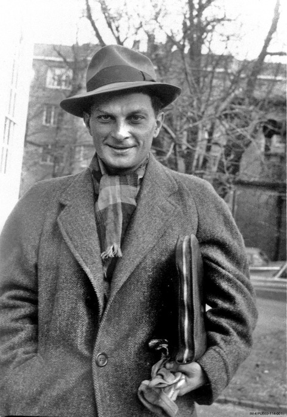

```{r, echo=FALSE}
knitr::opts_chunk$set(fig.align = "center")
knitr::opts_chunk$set(cache = TRUE)
```

```{r, echo=FALSE, message=FALSE}
library(tidyverse)
theme_set(theme_bw())
```


# Outline for Part III

- An overview of tools for Bayesian analysis in R

- The 'brms' package: probably the best place to start

- 15 minute break

- Hands-on exercises

---

# Fitting Bayesian Models

.pull-left[
- Computation for Bayesian models requires more expertise than fitting frequentist models. 

- Series of papers by Greenland written 10-15 years ago contain lots of tricks for approximately fitting Bayesian models using familiar software.

- In contrast, fairly complex mixed models can be estimated with a single line of code or the press of a button, e.g., mixed models, Cox regression.

]
.pull-right[


]

---

# Software for Fitting Bayesian Models

- Several attempts at making this process easier.

--

- [BUGS - Bayesian Inference Using Gibbs Sampling](https://www.mrc-bsu.cam.ac.uk/software/bugs/)
  
  - Early software, which you may encounter in older textbooks. Can be used, but no longer actively developed.
  
- [JAGS - Just Another Gibbs Sampler](https://mcmc-jags.sourceforge.io/)

  - Further development of BUGS, but no new releases last four years.
  
- [Stan](https://mc-stan.org/)

  - State-of-the-art tool for Bayesian computation, developed mainly at Columbia University.
  
  - Very active community.


---

# Fitting Bayesian Models

- Stan is a programming language of its own, definitely increasing the barrier for easy learning.

- Can use R packages that yield familiar syntax, translating R code into Stan code:

  - [rethinking](https://github.com/rmcelreath/rethinking)
  
  - [rstanarm](https://mc-stan.org/rstanarm/)
  
  - [brms](https://paul-buerkner.github.io/brms/)
  
- [You can also use Stan from Stata!](https://github.com/stan-dev/statastan)


---

# Stan?

.pull-left[
[Stanisław Ulam](https://en.wikipedia.org/wiki/Stanislaw_Ulam)

> a Polish scientist in the fields of mathematics and nuclear physics. He participated in the Manhattan Project, originated the Teller–Ulam design of thermonuclear weapons, discovered the concept of the cellular automaton, invented the Monte Carlo method of computation, and suggested nuclear pulse propulsion
]
.pull-right[

]


---

# brms

```{r, message=FALSE}
library(brms)
```

<center>

</center>

.footnote[
Bürkner, Paul-Christian. “brms: An R Package for Bayesian Multilevel Models Using Stan.” Journal of Statistical Software 80, no. 1 (August 29, 2017): 1–28. https://doi.org/10.18637/jss.v080.i01.
Bürkner, Paul-Christian. “Advanced Bayesian Multilevel Modeling with the R Package Brms.” The R Journal 10, no. 1 (2018): 395–411. https://doi.org/10.32614/RJ-2018-017.
]

---

# Fitting a logistic regression model with brms

```{r}
dat <- readRDS("data/bwt.rds")
head(dat)
```


---

# Fitting a logistic regression model with brms

```r
mod <- brm(Low ~ LWT, data = dat, family = bernoulli())
```
--
```r
## Compiling Stan program...
## Start sampling
## 
## SAMPLING FOR MODEL 'd3c8392ac3fcb0c96e96bdaad5582435' NOW (CHAIN 1).
## Chain 1: 
## Chain 1: Gradient evaluation took 2.1e-05 seconds
## Chain 1: 1000 transitions using 10 leapfrog steps per transition would take 0.21 seconds.
## Chain 1: Adjust your expectations accordingly!
## Chain 1: 
## Chain 1: 
## Chain 1: Iteration:    1 / 2000 [  0%]  (Warmup)
## Chain 1: Iteration:  200 / 2000 [ 10%]  (Warmup)
## ...
## Chain 4: Iteration: 1800 / 2000 [ 90%]  (Sampling)
## Chain 4: Iteration: 2000 / 2000 [100%]  (Sampling)
## Chain 4: 
## Chain 4:  Elapsed Time: 0.058381 seconds (Warm-up)
## Chain 4:                0.054892 seconds (Sampling)
## Chain 4:                0.113273 seconds (Total)
## Chain 4: 

```


---

# Fitting a logistic regression model with brms


```{r, eval=FALSE}
mod <- brm(Low ~ LWT, data = dat, family = bernoulli())
```

is very similar to

```{r, eval=FALSE}
mod_glm <- glm(Low ~ LWT, data = dat, family = binomial())
```

- `family = binomial()` would work with brms too, but is not the standard syntax.

---

# Model output

```{r, echo=FALSE, eval=FALSE}
mod <- brm(Low ~ LWT, data = dat, family = bernoulli())
saveRDS(mod, "data/mod.rds")
```

```{r, echo=FALSE}
mod <- readRDS("data/mod.rds")
```


```{r}
summary(mod)
```

---

class: inverse, middle, center

# Let's try to use the Bayesian workflow

---

# (a) Exploratory Data Analysis

- Important, but not particularly related to brms. 

- But if you want to get good at data visualization in R, there are lots of good and free resources at https://ggplot2.tidyverse.org/

- You'll also get some hands-on experience in the exercises.

---

# (b) Prior Distribution

In the previous lecture we decided on using a normal prior for $\beta_{LWT}$ with mean 0 and standard deviation 0.4.

We start by getting the default prior:

```{r}
prior <- get_prior(Low ~ LWT, family = bernoulli(), 
                   data = dat)
print(prior, show_df = FALSE)
```

- "b" denotes all population-level parameters
- "b_LWT" denotes the particular LWT parameter
- "Intercept" is intercept...

---

# (b) Prior Distribution

Update to get what we want:

```{r}
prior$prior[2] <- "normal(0, 0.4)"
```

--

Check that prior is updated:

```{r}
print(prior, show_df = FALSE)
```

---

# (c) Check that the computations work correctly

Then we have to fit the model first, with our preferred prior:

```{r, eval=FALSE}
mod <- brm(Low ~ LWT, data = dat, family = bernoulli(),
           prior = prior)
```


```{r, eval=FALSE, echo=FALSE}
mod <- brm(Low ~ LWT, data = dat, family = bernoulli(),
           prior = prior)
saveRDS(mod, "data/mod_prior.rds")
```

```{r, echo=FALSE}
mod <- readRDS("data/mod_prior.rds")
```

--

```
## Compiling Stan program...
## recompiling to avoid crashing R session
## Start sampling
## 
## SAMPLING FOR MODEL 'f53afefa5fd92239adec95c91ede857a' NOW (CHAIN 1).
## Chain 1: 
## Chain 1: Gradient evaluation took 2.2e-05 seconds
## Chain 1: 1000 transitions using 10 leapfrog steps per transition would take 0.22 seconds.
## Chain 1: Adjust your expectations accordingly!
## Chain 1: 
## Chain 1: 
## Chain 1: Iteration:    1 / 2000 [  0%]  (Warmup)
## Chain 1: Iteration:  200 / 2000 [ 10%]  (Warmup)
## Chain 1: Iteration:  400 / 2000 [ 20%]  (Warmup)
## Chain 1: Iteration:  600 / 2000 [ 30%]  (Warmup)
## Chain 1: Iteration:  800 / 2000 [ 40%]  (Warmup)
## Chain 1: Iteration: 1000 / 2000 [ 50%]  (Warmup)
## Chain 1: Iteration: 1001 / 2000 [ 50%]  (Sampling)
## Chain 1: Iteration: 1200 / 2000 [ 60%]  (Sampling)
## Chain 1: Iteration: 1400 / 2000 [ 70%]  (Sampling)
## Chain 1: Iteration: 1600 / 2000 [ 80%]  (Sampling)
## Chain 1: Iteration: 1800 / 2000 [ 90%]  (Sampling)
## Chain 1: Iteration: 2000 / 2000 [100%]  (Sampling)
## Chain 1: 
## Chain 1:  Elapsed Time: 0.032954 seconds (Warm-up)
## Chain 1:                0.025207 seconds (Sampling)
## Chain 1:                0.058161 seconds (Total)
## Chain 1: 
## 
```


---

# (c) Check that computations work correctly

```{r, eval=TRUE, dev='svg', fig.height=3}
plot(mod)
```


Most of the plotting functions in brms use the BayesPlot package, which has a [homepage with many nice examples of what can be done](https://mc-stan.org/bayesplot/).

---

# (c) Check that computations work correctly

```{r, eval=TRUE, dev='svg', fig.height=4}
plot(mod, combo = c("parcoord", "rank_overlay"))
```


---

# (c) Check that computations work correctly

```{r}
summary(mod)
```


---

# (d) Posterior predictive checks

```{r, eval=TRUE, dev='svg', fig.height=3, fig.width=5}
pp_check(mod)
```

A very fancy way of checking that the proportion of children with low birthweights is replicated by the model predictions.

---

# (d) Posterior predictive checks

```{r, eval=TRUE, dev='svg', fig.height=4}
pp_check(mod, ndraws = 100)
```

---

# (d) Error histograms

```{r, eval=TRUE, dev='svg', fig.height=4}
pp_check(mod, type = "error_hist", ndraws = 12, binwidth = 1)
```


---

# (d) Error histograms


.pull-left[

- Low birthweight is coded as 1 and normal as 0.

- The table shows what $y - y_{\text{rep}}$ means:

| $y - y_{\text{rep}}$ | Predicted low bw $y_{\text{rep}}=1$ | Predicted normal bw $y_{\text{rep}}=0$ |
| ---- | ---- | ---- |
| Actual low bw $y=1$ | 0 | 1 | 
| Actual normal bw $y=0$ | -1 | 0 | 

]
.pull-right[

```{r, eval=TRUE, dev='svg', echo=FALSE, fig.height=5, fig.width=4}
pp_check(mod, type = "error_hist", ndraws = 4, binwidth = 1)
```

]


---

# (d) Scatter plot

True value on y-axis, average prediction on x-axis.

```{r, eval=TRUE, dev='svg', fig.height=3, fig.width=5}
pp_check(mod, type = "scatter_avg")
```

---

# (d) Bar plot

```{r, eval=TRUE, dev='svg', fig.height=3, fig.width=5}
pp_check(mod, ndraws = 100, type = "bars")
```

True data in light blue, predictions from repeated sampling from the model overlayed.

---

# (e) Compare to other more or less complicated models

Extend the model by adding smoking status

```{r, eval=FALSE}
mod2 <- brm(Low ~ LWT + Smoker, data = dat, 
            family = bernoulli())
```


---

# (e) Compare to other more or less complicated models

We need priors!

```{r, eval=FALSE}
mod2 <- brm(
  Low ~ LWT + Smoker, data = dat, 
  family = bernoulli(),
  prior = c(
    set_prior(prior = "normal(0, 0.4)", class = "b", 
              coef = "LWT"),
    set_prior(prior = "normal(0, 2)", class = "b", 
              coef = "SmokerTRUE")
  ))
```

- Let's stick to this prior for smoking now. You will look further at it in the exercises.

```{r, echo=FALSE, eval=FALSE}
saveRDS(mod2, "data/mod2.rds")
```

```{r, echo=FALSE}
mod2 <- readRDS("data/mod2.rds")
```

---

# (e) Model with smoking

```{r, eval=TRUE, dev='svg', fig.height=4}
plot(mod2)
```


---

# (e) Compare by leave-one-out cross-validation

```{r}
loo1 <- loo(mod, model_names = "LWT")

loo2 <- loo(mod2, model_names = "LWT+Smoker")

loo_compare(loo1, loo2)
```

- Model without smoking yields worse fit, but not "significantly". 

  - How can we tell?


--

- We keep both, and analyse their estimates.

---

# Examine the model outputs

```{r, dev='svg', fig.height=4}
conditional_effects(mod)
```

---

# Examine the model outputs

```{r, dev='svg', fig.height=4}
conditional_effects(
  mod2, effects = "LWT",
  conditions = data.frame(Smoker = c(FALSE, TRUE),
                          cond__ = c("Non-smoker", "Smoker")))
```

---

# Posterior intervals

```{r, dev='svg', fig.height=4}
mcmc_plot(mod2)
```

---

# Joint Posterior Density

```{r, dev='svg', fig.height=4, fig.width=6}
mcmc_plot(mod2, variable = c("b_LWT", "b_SmokerTRUE"), 
          type = "scatter")
```

---

# Joint Posterior Density

```{r, dev='svg', fig.height=4, fig.width=6}
mcmc_plot(mod2, type = "pairs")
```

---

# Joint Posterior Density

What's the probability the both $\beta_{LWT} > 0$ and $\beta_{Smoker} < 0$, i.e., that smoking is protective and the probability of low birthweight increases with mother's weight?

```{r}
df <- as_draws_df(mod2)
head(df)
```


---

# Joint Posterior Density

Let's do this carefully. First select columns.

```{r}
df %>% 
  as_tibble() %>% 
  select(b_LWT, b_SmokerTRUE)
```


---

# Joint Posterior Density

Label the ones that meet our criteria.

```{r}
df %>% 
  as_tibble() %>% 
  select(b_LWT, b_SmokerTRUE) %>% 
  mutate(meets_criteria = b_LWT > 0 & b_SmokerTRUE < 0)
```


---

# Joint Posterior Density

Find the proportion of samples from posterior distribution that meets the criteria.

```{r}
df %>% 
  as_tibble() %>% 
  select(b_LWT, b_SmokerTRUE) %>% 
  mutate(meets_criteria = b_LWT > 0 & b_SmokerTRUE < 0) %>% 
  summarise(proportion = mean(meets_criteria))
```

---

# Joint Posterior Density

What's the probability that the odds ratio associated with a 1 kg difference in mother's weight is between 0.99 and 1.01?

```{r}
df %>% 
  as_tibble() %>% 
  select(b_LWT) %>% 
  mutate(
    odds_ratio = exp(b_LWT),
    meets_criteria = between(odds_ratio, .99, 1.01))
```


---

# Joint Posterior Density

Find proportion that meets criteria

```{r}
df %>% 
  as_tibble() %>% 
  select(b_LWT) %>% 
  mutate(
    odds_ratio = exp(b_LWT),
    meets_criteria = between(odds_ratio, .99, 1.01)
    ) %>% 
  summarise(proportion = mean(meets_criteria))
```

This is the posterior probability that the odds ratio is between 0.99 and 1.01.


---

# Bayes Factors

- A Bayesian alternative to hypothesis testing: compare the posterior probabilities of two models.

```{r, eval=FALSE}
bayes_factor(mod, mod2)
```

- But Bayes factors work both ways.

  - High posterior probability of `mod` means effect of `Smoker` is close to zero.
  
  - High posterior probability of `mod2` means effect of `Smoker` is not zero.
  
- Practical use of Bayes factors often criticized by statistics. In particular, the answers may be very sensitive to the choice of priors.

---

# Bayes Factors - Proving the null

<center>


</center>

.footnote[Nyberg, Lars, Fredrik Magnussen, Anders Lundquist, William Baaré, David Bartrés-Faz, Lars Bertram, C. J. Boraxbekk, et al. “Educational Attainment Does Not Influence Brain Aging.” Proceedings of the National Academy of Sciences 118, no. 18 (May 4, 2021). https://doi.org/10.1073/pnas.2101644118.]

---

# Bayes Factors - Proving the null

From the Nyberg et al. paper:

> The informative prior assigned a very large prior probability that the effect of interest was close to zero (SD = 0.5 mm3/y). The obtained BF01 = 1.29 implies that the posterior probability is even more concentrated around zero than the informative prior, thus favoring the null hypothesis.


Table for recommended interpretation following Jeffreys (1961) [can be found on Wikipedia](https://en.wikipedia.org/wiki/Bayes_factor).


.footnote[Jeffreys, Harold (1998) [1961]. The Theory of Probability (3rd ed.). Oxford, England. p. 432. ISBN 9780191589676.]

---


class: inverse, middle, center

# Was all of this worth the effort?

---

# Was all of this worth the effort?

Maybe not in this particular case, but Bayesian models can easily be extended.


---

# Covariate measurement error

.pull-left[
Regression model. 

$$y = \beta_{0} + x \beta + \epsilon$$

$x$ is measured with error, so we don't see it. Instead we have $w$, defined by

$$w = x + \delta$$

(Measured = True + Noise)

Using measurements $w$ lead to bias in $\beta$. Quite straightforward to take into account in Bayesian models.

- Treat true value $x$ as an unknown parameter, just like $\beta$. Sample it from the posterior.
]

.pull-right[


]


---

# Missing Data

What if data are missing?

Treat the missing data as parameters. Sample them from posterior together with all other parameters.

See, e.g., [the mice package](https://CRAN.R-project.org/package=mice).


---

# Hierarchical Models

- Longitudinal designs with repeated measurements

- Other grouping structures (students nested in classes nested in schools)

.pull-left[
Example in brms. Linear mixed model with random slopes.

```{r, eval=FALSE}
mod <- brm(
  y ~ age + (age | id), 
  data = dat)
```


- Can study level-slope correlation: Do people who start out high grow faster or slower?


]

.pull-right[


```{r, echo=FALSE}
n <- 100
tibble(
  id = 1:n,
  tp = list(0:3),
  b0 = rnorm(n),
  b1 = rnorm(n, sd = .4)
) %>% 
  unnest(cols = tp) %>% 
  mutate(
    y = (1 + b1) * tp + b0 + rnorm(nrow(.))
  ) %>% 
  ggplot(aes(x = tp, y = y, group = id)) + 
  geom_line()
```


]


---

# Philosophical Issues

- Statistical methods and analysis workflows relate the philosophy of science.

- Frequentist methods associated with *deductive inference*, and if practiced correctly, ensure long-term error control at the $\alpha$ level.

- Bayesian methods have been identified as *inductive inference*. However, Gelman and Shalizi (2013) argue that Bayesian inference as it is used by practitioners, is *deductive inference*.

- If interested in these issues, see Mayo (2018) for an impressive book.

.footnote[
Gelman, Andrew, and Cosma Rohilla Shalizi. “Philosophy and the Practice of Bayesian Statistics.” British Journal of Mathematical and Statistical Psychology 66, no. 1 (2013): 8–38. https://doi.org/10.1111/j.2044-8317.2011.02037.x.

Mayo, Deborah G. Statistical Inference as Severe Testing: How to Get Beyond the Statistics Wars. 1st ed. Cambridge, UK: Cambridge University Press, 2018.
]

---

class: center, middle

# Thanks!

Slides created via the R package [**xaringan**](https://github.com/yihui/xaringan).

The chakra comes from [remark.js](https://remarkjs.com), [**knitr**](https://yihui.org/knitr/), and [R Markdown](https://rmarkdown.rstudio.com).
